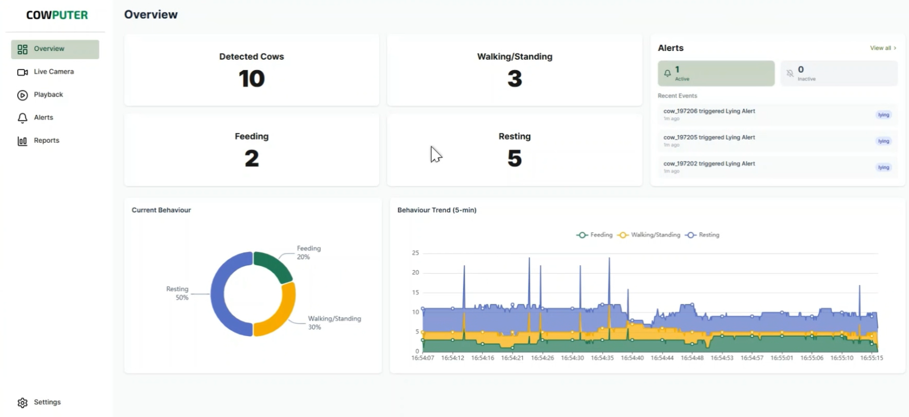
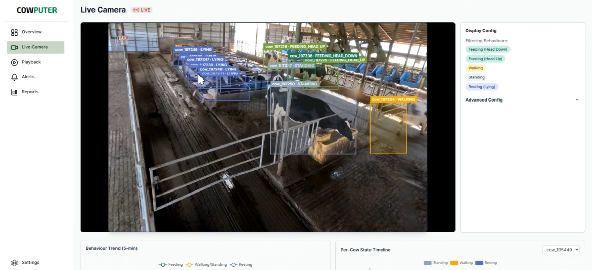
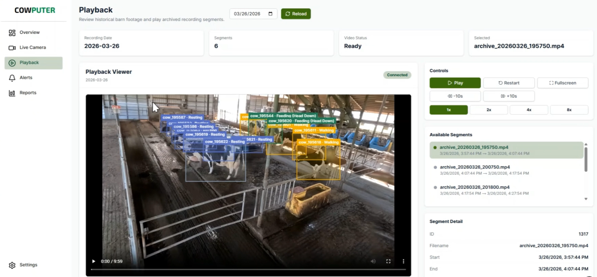

# Cowputer Vision

AI-powered cow monitoring and behavior analysis system for dairy farms. The system uses a YOLOv12-based computer vision pipeline to detect, track, and classify cow behaviors from an RTSP camera feed in real time, with a web dashboard for live viewing, playback, alerting, and reporting.

## Screenshots

<p align="center">
  
  <br>
  <em style="color:#666">Overview</em>
</p>

<p align="center" style="margin-top: 10px">
  
  <br>
  <em style="color:#666">Live</em>
</p>

<p align="center" style="margin-top: 10px">
  
  <br>
  <em style="color:#666">Playback</em>
</p>

## Features

- **Live Camera Feed** — Real-time HLS video stream with bounding-box overlays for detected cows
- **Behavior Classification** — Automatic detection and classification of cow behaviors (feeding, standing, lying, etc.)
- **Track Query** — Query historical tracking data with a flexible JsonLogic-based filter builder
- **Alert Rules** — Create condition-based alert rules (e.g. "cow feeding > 60 s") with email and webhook notifications
- **Video Playback** — Browse and play back archived recordings with timestamp-based search
- **Daily Reports** — Automated daily behavior reports with per-cow breakdowns and percentage charts
- **Settings & Retention** — Configurable recording retention (by age and disk usage), notification preferences, and inference tuning
- **Password Reset** — Email-based password reset flow

## Architecture

```
┌──────────────────┐      ┌──────────────────────────────────────────┐
│                  │      │              Backend                     │
│    Frontend      │ HTTP │  ┌────────────┐  ┌───────────────────┐  │
│   (Next.js)      ├─────►│  │ Django API  │  │ Intelligence      │  │
│                  │      │  │ (DRF + JWT) │  │ Daemon            │  │
│  - Dashboard     │◄─HLS─│  └──────┬─────┘  │  - Inference      │  │
│  - Live Camera   │      │         │        │  - Event Monitor  │  │
│  - Playback      │      │         ▼        │  - Playback Mgr   │  │
│  - Alerts        │      │   ┌──────────┐   │  - Report Mgr     │  │
│  - Reports       │      │   │PostgreSQL│   └────────┬──────────┘  │
│  - Settings      │      │   └──────────┘            │             │
│                  │      │         ▲        ┌────────▼──────────┐  │
│                  │      │         │        │ Media Server      │  │
│                  │      │         │        │ (FFmpeg HLS)      │  │
└──────────────────┘      │         │        └───────────────────┘  │
                          │         │                │              │
                          │         └──── storage/ ◄─┘              │
                          └──────────────────────────────────────────┘
                                             ▲
                                             │ RTSP
                                        ┌────┴────┐
                                        │ IP Cam  │
                                        └─────────┘
```

| Component               | Tech Stack                                                | Description                                                                                |
| ----------------------- | --------------------------------------------------------- | ------------------------------------------------------------------------------------------ |
| **Frontend**            | Next.js 16, React 19, TailwindCSS, TanStack Query, Zodios | Web dashboard with live camera, playback, alerts, reports, and settings                    |
| **Django API**          | Django 5.2, DRF, SimpleJWT                                | REST API with JWT authentication serving all CRUD endpoints                                |
| **Intelligence Daemon** | Python, YOLOv12, OpenCV, PyTorch                          | Four background daemons: inference engine, event monitor, playback manager, report manager |
| **Media Server**        | FFmpeg                                                    | Dual HLS output — low-latency live feed + archival 10-minute segments                      |
| **Database**            | PostgreSQL                                                | Stores tracking data, alert rules, video segment metadata, reports, and settings           |
| **ML Model**            | YOLOv12-m                                                 | Custom-trained on the MmCows dataset for cow detection and behavior classification         |

## Project Structure

```
cowputer-vision/
├── frontend/              # Next.js web dashboard
│   ├── app/               #   Pages (dashboard, auth, playback, alerts, reports, settings)
│   ├── api/               #   API client (Zodios + zod)
│   ├── components/        #   Reusable UI components
│   ├── hooks/             #   React hooks (react-query wrappers)
│   └── services/          #   Backend API service layer
├── backend/               # Python backend (Django + daemons + FFmpeg)
│   ├── core_app/          #   Django project (API views, models, serializers)
│   ├── daemon/            #   Intelligence daemon (4 background services)
│   ├── media_server/      #   FFmpeg shell scripts for HLS streaming
│   ├── models/            #   YOLO model weight files (.pt)
│   ├── storage/           #   HLS segments and recordings
│   ├── yolov12/           #   Vendored YOLOv12 fork
│   └── tests/             #   pytest test suite (154 tests)
├── model/                 # ML training and evaluation scripts
│   ├── train.py           #   YOLOv12 training script (multi-GPU)
│   ├── test1_detection.py #   Detection accuracy evaluation
│   ├── test2_behaviour.py #   Behavior classification + ROC curves
│   ├── test3_tracking.py  #   Multi-object tracking evaluation
│   └── test4_runtime.py   #   Inference performance benchmarking
└── files/                 # Project documents (SRS, design doc, poster, demo video)
```

## Getting Started

### Prerequisites

- Python 3.11+
- Node.js 20+ (LTS)
- PostgreSQL 14+
- FFmpeg

### Backend Setup

```bash
cd backend

# Install Python dependencies
pip install -r requirements.txt

# Install YOLOv12
pip install -e yolov12/

# Configure environment
cp .env.example .env    # Edit with your DB credentials and RTSP URL

# Run database migrations
cd core_app && python manage.py migrate && cd ..

# Start all backend services (Django + daemons + media server)
python run.py all
```

See [backend/README.md](backend/README.md) for all available commands and environment variables.

### Frontend Setup

```bash
cd frontend

# Install dependencies
npm install

# Start development server
npm run dev
```

Open http://localhost:3000 — the app redirects to the dashboard overview.

### Running Tests

```bash
cd backend

# Install test dependencies
pip install -r requirements-dev.txt

# Run full test suite (154 tests)
python -m pytest

# Run by component
python -m pytest tests/api/          # 89 API endpoint tests
python -m pytest tests/daemon/       # 63 daemon unit tests
python -m pytest tests/test_media_server.py  # 2 integration tests
```

```bash
cd frontend

# Run frontend tests
npm test
```

## Tech Stack

| Layer              | Technology                                       |
| ------------------ | ------------------------------------------------ |
| Frontend Framework | Next.js 16 (App Router)                          |
| UI                 | React 19, TailwindCSS, Headless UI, Lucide Icons |
| State Management   | TanStack React Query, React Hook Form            |
| API Client         | Zodios (OpenAPI + Zod validation)                |
| Video Player       | hls.js                                           |
| Charts             | ECharts                                          |
| Backend Framework  | Django 5.2, Django REST Framework                |
| Authentication     | SimpleJWT (access + refresh tokens)              |
| ML Framework       | YOLOv12 (ultralytics), PyTorch, OpenCV           |
| Database           | PostgreSQL (psycopg2)                            |
| Streaming          | FFmpeg (HLS live + archival)                     |
| Testing            | pytest, pytest-django, Jest                      |
